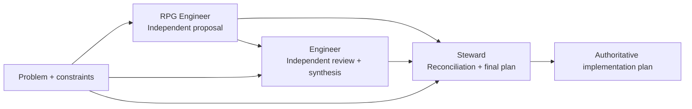

# Proposal Review and Synthesis Method

Status: **Normative workflow**
Contract: `proposal-review-synthesis/1`

## Purpose

Use this workflow for consequential architecture, protocol, governance, extraction, installation, or production-design proposals where independent reasoning and an authoritative final plan are valuable.

The method separates **invention**, **technical challenge**, and **governance reconciliation** so that one invocation does not silently become author, reviewer, and authority.

## Workflow



| Stage | Role | Receives | Produces | Must not do |
|---|---|---|---|---|
| 1 | RPG Engineer | Problem, constraints, governing evidence | Independent proposal | Treat a suggested solution as predetermined architecture |
| 2 | Engineer | Problem, constraints, complete Stage-1 proposal | Independent review and architecture/implementation synthesis | Merely endorse or rewrite Stage 1 |
| 3 | Project Engineering Steward | Problem, constraints, Stage-1 proposal, complete Stage-2 review | Reconciled final disposition and implementation-ready plan | Hide disagreements, erase uncertainty, or delegate Steward authority backward |

## Stage 1 — Independent proposal

Invoke the **RPG Engineer** with the problem to solve, relevant constraints, governing contracts, and evidence.

Guidance may explain desired properties or observations, but should not dictate the architecture unless a decision has already been made by an authority that binds the proposal.

The proposal should identify:

- the problem and decision requested;
- proposed architecture or policy;
- boundaries and dependency direction;
- invariants;
- implementation sequence and gates;
- risks, alternatives, and unresolved questions;
- acceptance criteria.

The Stage-1 artifact is durable and remains unchanged after submission. Later stages create separate artifacts or a clearly separate final document rather than editing history to make the proposal appear prescient.

## Stage 2 — Independent engineering review and synthesis

Invoke a separate **Engineer** activation. Supply the original problem/constraints and the complete Stage-1 proposal.

The Engineer should challenge the proposal rather than assume it is correct. Review at least:

- architectural boundaries and dependency direction;
- implementability and migration sequencing;
- coupling and unnecessary abstraction;
- failure modes and recovery;
- versioning/compatibility implications;
- testability and acceptance gates;
- contradictions, omissions, and ambiguous ownership.

The Engineer produces a separate review plus synthesis of the architecture and implementation plan. Findings should distinguish blockers, required amendments, recommendations, and optional improvements.

## Stage 3 — Steward reconciliation and finalization

Invoke the **Project Engineering Steward** with:

1. the original problem and constraints;
2. the complete RPG Engineer proposal;
3. the complete Engineer review/synthesis;
4. any governing project contracts or authority evidence required for the decision.

The Steward reconciles the materials and owns the final project-scoped disposition where Steward authority applies.

The final artifact must explicitly state:

- RPG Engineer recommendation;
- Engineer recommendation;
- Steward disposition;
- accepted and rejected amendments;
- disagreements and their resolution;
- remaining uncertainties or blocked decisions;
- approved invariants;
- architecture and ownership boundaries;
- ordered implementation plan and gates;
- definition of done / acceptance criteria;
- exact next authorized action.

The Steward must not describe unresolved disagreement as consensus.

## Final-document design

The final plan is an implementation artifact, not a transcript. Optimize it for fast, reliable reasoning.

Use the smallest structures that make the design easier to understand:

- short prose for decisions and rationale;
- tables for ownership, responsibilities, alternatives, gates, and invariants;
- directory trees for repository/package layout;
- Mermaid diagrams for architecture, data flow, authority flow, or lifecycle where spatial relationships matter;
- numbered sequences for implementation order;
- concise checklists for acceptance criteria.

Avoid decorative graphics, duplicated explanation, and long narrative when a table or diagram communicates the same information more precisely.

## Evidence and provenance

Every invocation must be independently attributable. Persist enough information to reconstruct the review chain:

```text
problem / governing evidence
        |
        +--> RPG Engineer proposal
        |
        +--> Engineer review + synthesis
        |
        `--> Steward final plan
```

The final plan should reference the exact proposal and review artifacts it reconciles. When repository state matters, bind reviews to immutable commits or blob identities rather than mutable branch names alone.

## Role separation

Role separation is semantic, not merely a heading change.

- The RPG Engineer explores and proposes.
- The Engineer independently challenges and synthesizes.
- The Steward reconciles under project authority and finalizes the actionable plan.

A later role receives earlier artifacts but should reason independently within its mandate. Earlier roles do not gain Steward authority because their work is incorporated into the final plan.

If the same underlying assistant performs multiple activations, each activation must still be bounded by its role, inputs, and output artifact. Do not silently carry an earlier role's conclusion forward as established fact.

## When to use a different workflow

This three-stage method is intentionally heavier than ordinary engineering review. Do not require it for routine implementation, mechanical refactors, typo fixes, or changes already fully determined by an approved plan.

Escalate or modify the workflow when:

- a governing authority other than the Steward owns the final decision;
- specialized security, legal, safety, or domain review is required;
- implementation discovers a constraint that invalidates an approved architectural assumption;
- the Steward determines that additional independent evidence is required before disposition.

## Completion invariant

A proposal review is complete only when the final artifact makes it possible for an implementer to determine, without reconstructing the review conversation:

1. what was decided;
2. why it was decided;
3. what remains uncertain;
4. who owns each relevant authority or artifact;
5. what invariants must hold;
6. what to implement and in what order;
7. how completion will be proven.
