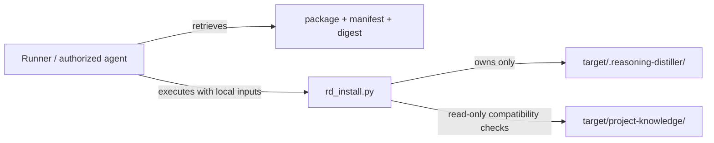

# Reasoning Distiller Installer Runner Contract

Status: **Normative pre-P3 contract**
Contract: `reasoning-distiller-installer/1`
Governing plan: `docs/proposals/install-package/FINAL_PLAN.md`
Package contract: `reasoning-distiller-install-package/1`

## Decision

The canonical V1 installer is a **network-independent deterministic Python 3 CLI** named:

```text
rd_install.py
```

It is executed inside a runner that already has filesystem access and whatever project authority is required to modify the target workspace. The installer receives local files and an explicit project target; it does not retrieve packages, choose releases, acquire credentials, or contact the source repository.

Typical invocation:

```bash
python3 rd_install.py \
  --package reasoning-distiller-0.1.0.tar.gz \
  --manifest reasoning-distiller-0.1.0.manifest.json \
  --transport-sha256 <64-hex> \
  --target /workspace/project
```

The exact CLI may add explicit compatibility, recovery, or validation options during P3, but all inputs affecting installed state must be explicit and deterministic.

## Runner boundary



The runner may be GitHub Actions, Codex, another agent runtime, CI, or a local shell. Runner identity does not affect package content or installed framework bytes.

## Deterministic inputs

The install result may depend only on declared inputs and target pre-state:

- exact package bytes;
- exact verified manifest;
- expected transport SHA-256;
- explicit target project directory;
- existing managed installation state and its verified manifest;
- explicit compatibility/project configuration read by the installer;
- explicit recovery/downgrade policy options when those are implemented.

The installer must not use current network state, repository branch heads, environment-specific source-repository paths, implicit version discovery, or current time to decide framework content.

## Deterministic outputs

For the same declared inputs and equivalent target pre-state, the installer must either:

1. produce the same package-managed file tree and same deterministic validation result; or
2. fail with the same classified installation condition.

Framework content, file paths, file modes, drift decisions, compatibility decisions, and recovery decisions are deterministic outputs.

## Event metadata

Operational event metadata is not framework content and is excluded from package content identity. It may include:

- `installed_at`;
- runner kind/name;
- invocation or workflow ID.

Event metadata must never change which framework files are installed or how their bytes are derived.

## Network prohibition

`rd_install.py` must not perform network I/O. It must not:

- download package artifacts;
- query GitHub or another publisher;
- resolve a version remotely;
- fetch missing schemas or code;
- clone/check out the generic repository;
- fall back to remote content when local content is absent.

Retrieval and update discovery belong to the runner/agent before installer execution.

## Filesystem authority

The installer may mutate only the declared Reasoning Distiller managed root and its transaction/recovery material. Project knowledge, project integration wrappers, canonical state, authority, policy, evidence, adapters, and role activation are read-only inputs at most.

## Portability

V1 targets Python 3.12 as the conformance runtime used by CI. The implementation should use the Python standard library wherever practical. Any required external dependency must be explicit, pinned by the runner, and must not introduce network behavior into installer execution.

## P3 conformance requirements

The P3 implementation of `rd_install.py` must prove:

- clean install is deterministic;
- repeated install of identical package is idempotent;
- update behavior is deterministic from old manifest + new package;
- managed-file drift fails closed by default;
- unsafe archive paths and manifest disagreement fail closed;
- failed validation restores/preserves the previous known installation;
- no project-owned path is mutated;
- network access is unnecessary and absent;
- source-repository unavailability does not affect execution;
- `installed_at` and runner metadata do not affect installed framework bytes.

P1 defines this execution contract. P3 implements the installer transaction and recovery behavior.