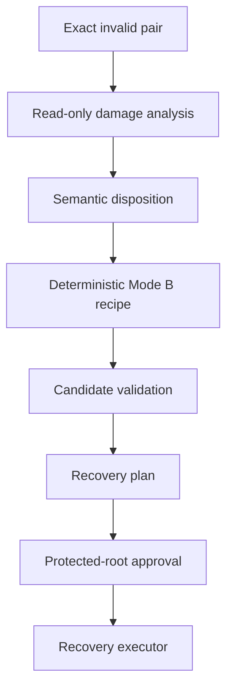

# Stage 1 RPG Engineer Proposal: Mode B Relation-Schema Recovery

Status: **Stage 1 independent proposal only** under `proposal-review-synthesis/1`

Repository: `loteque/reasoning-distiller`

Coordination control ref: `main`

Coordination revision inspected and re-resolved before this proposal write: `d46300a54a444cc866717986c1f5b493de3ab13f`

Mode A implementation candidate inspected: `51ae28dca034cdd431b161a46d0f5cbc1a7e0116`

Mode A candidate tree: `c523ce99ea2932d070482d1fb14c556773f6405a`

Governing accepted Mode A plan: `c7445be11460a1c20c6b7c98bf39684a1bf41197`, `docs/proposals/canonical-pems-cove-recovery/03-steward-final-plan.md`

Incident evidence inspected: `evaluation/context-packaging/canonical-recovery-rehearsal/2026-08-31-g8-corrected.json` at the Mode A candidate above

Proposal-author scope: **Reasoning Graph Protocol Engineer**

Authority posture: this artifact is a technical proposal only. The Engineer directive permits protocol and framework design but grants no project Steward authority, semantic-reconciliation authority, recovery execution authority, protected-root authority, admission authority, or RIL authority. No accepted RIL activation is claimed or required for this non-authoritative Stage 1 proposal. This proposal does not authorize implementation or recovery.

## 1. Problem and decision requested

The selected immutable canonical PEMS blob is:

- Git blob `bb7c474e935243b45ff02a5778a94bbcdc654d72`;
- SHA-256 `22beb53b220ea820b65e7a77f1db2be3ecde1aad7de95a4f5523942819511061`.

Independent inspection establishes that it is strict JSON with top-level `"semantic":"pems/2"`. R14 V2 rejects it as `PEMS_SCHEMA_INVALID` because every one of its 668 relation objects lacks both schema-required `lifecycle` and `data` members. Every relation has exactly the keys `from`, `id`, `kind`, and `to`; 661 are `supports` and 7 are `depends_on`.

The accepted V1 recipe `missing_top_level_semantic_pems2/1` requires the prestate to have no top-level `semantic`. It therefore rejects this incident at predicate 2 with `UNSUPPORTED_CANONICAL_DAMAGE`, emits zero candidates, computes no recovery plan, and makes G10 unavailable.

The decision requested is whether to add a new **Mode B relation-schema repair** capable of recovering this exact damage class without weakening Mode A, inventing historical standing, or treating inferred lifecycle and relation data as representation-only changes.

## 2. Recommendation

Design Mode B as a separately versioned, reconciliation-gated semantic repair profile layered on the accepted canonical-store, preservation, publication, rollback, and recovery-provenance substrate from Mode A.

Mode B should not initially implement general admission-lineage reconstruction. Its first recipe family should be narrowly limited to relation objects that are otherwise structurally complete but omit fields required by the current PEMS/2 schema:

`missing_relation_lifecycle_and_data_pems2/1`

The deterministic machinery may enumerate the missing fields and materialize values only from an exact, approved incident-specific semantic disposition. It must not infer `"lifecycle":"current"` or `"data":{}` merely because those values appear plausible or make validation pass.

The proposal recommends this authority split:

1. an authorized and activated `semantic_reconciliation` Steward produces an immutable Mode B semantic disposition binding the exact prestate and the exact field values for a closed relation set;
2. the read-only planner deterministically applies only that disposition, proves all unchanged content is byte/object preserved, and produces one candidate and one recovery plan;
3. a fresh protected-root approval binds the exact Mode B recovery-plan digest;
4. the deterministic recovery executor reuses the accepted recovery transaction substrate and performs no judgment.

No new R7/R8 `canonical_recovery` scope is proposed. Semantic authority and exceptional mutation authority remain separate: semantic reconciliation chooses the repair meaning; protected-root approval authorizes one exact canonical transition.

## 3. Governing boundary

Mode B is a new design cycle, not an extension silently implied by Mode A implementation success.

- The accepted Mode A plan explicitly makes Mode B unsupported and requires proposal -> independent review/synthesis -> Steward reconciliation.
- The Mode A contract must continue returning `UNSUPPORTED_CANONICAL_DAMAGE` for this incident.
- Mode B implementation must not begin until Stage 3 accepts an exact design and implementation gates.
- A real recovery remains outside implementation and requires a separately selected invocation and fresh protected-root approval.
- Canon, recovery standing, admission state, authority state, and P3 remain unchanged throughout the proposal cycle.

The current Mode A implementation is still an open draft PR. A future Mode B implementation must bind to a reviewed and durably selected recovery substrate; it must not assume that PR #96 has merged merely because this proposal cites its immutable candidate as design evidence.

## 4. Proposed architecture

Ownership and dependency direction:

| Component | Owns | Must not own |
|---|---|---|
| PEMS schema/validator | current structural and semantic validity | incident authority |
| damage analyzer | exact omissions and unchanged-field inventory | repair values |
| semantic disposition | authoritative incident-specific values and rationale | mutation execution |
| Mode B recipe | closed deterministic transform and proof | free-form inference |
| recovery planner | candidate, proof, closure, plan digest | approval or mutation |
| protected root | authority for one exact plan | semantic authorship |
| executor | exact approved publication and rollback | semantic choice |

Mode B should reuse, after exact identity binding and conformance review, the Mode A canonical-store lock/barrier protocol, evidence preservation, executable-closure model, COVE regeneration, completion provenance, R14 V2 `VERIFIED_RECOVERED` result, and retry/rollback rules. New Mode B code should be limited to damage classification, semantic-disposition validation, recipe execution, proof generation, and the corresponding plan bindings.

## 5. Proposed semantic disposition

Define a canonical immutable contract such as:

`reasoning-distiller-canonical-recovery-semantic-disposition/1`

It should contain at least:

- exact project identity;
- exact prestate PEMS and COVE SHA-256 values and available Git blobs;
- exact damage-analysis artifact path and digest;
- recipe family `missing_relation_lifecycle_and_data_pems2/1`;
- exact sorted relation-ID set covered by the disposition;
- for each covered relation, the exact inserted `lifecycle` and `data` values, either explicitly or through a closed uniform rule whose expansion is included in the digest domain;
- explicit statement that no existing key or value may be removed, replaced, or reordered semantically;
- rationale and evidence for the chosen lifecycle and data values;
- authorized role ID, accepted `semantic_reconciliation` activation digest, and invocation ID;
- disposition outcome `ACCEPT_REPAIR` or `REJECT_REPAIR`.

An `ACCEPT_REPAIR` disposition is semantic decision evidence, not recovery approval. It cannot mutate Canon, create a recovery plan by itself, or satisfy protected-root approval.

R12's existing candidate-focused reconciliation contract should not be silently repurposed. Stage 2 should determine whether this new disposition can lawfully use the existing `semantic_reconciliation` R7/R8 scope through a new domain contract or whether a narrower authority contract is required. No scope expansion should be inferred.

## 6. Closed initial recipe

The initial recipe is eligible only if every predicate below is mechanically true:

1. exact prestate PEMS/COVE identities match the plan inputs;
2. PEMS is strict UTF-8 JSON with top-level `semantic: "pems/2"`, expected project identity, records array, and relations array;
3. ordinary R14 V2 fails `PEMS_SCHEMA_INVALID` and the complete schema-error set is exactly the omissions covered by the recipe;
4. every covered relation has exactly `id`, `kind`, `from`, and `to`, lacks both `lifecycle` and `data`, and has a unique ID;
5. no uncovered record or relation has a schema or semantic defect;
6. prestate COVE decodes exactly to the prestate PEMS object;
7. one accepted semantic disposition binds the exact prestate and covers every and only affected relation ID;
8. the recipe deep-copies the prestate and inserts only the disposition-bound `lifecycle` and `data` members into covered relations;
9. deleting only those inserted members from the candidate yields an object deeply equal to the prestate, preserving relation order and every existing nested value;
10. candidate normalization changes no semantic graph element beyond deterministic object-key and permitted sequence normalization explicitly proven by the plan;
11. candidate PEMS passes the exact bound current schema and semantic/integrity validator;
12. candidate COVE is generated only from candidate PEMS, decodes exactly to it, and reserializes to identical PEMS bytes;
13. repeated analysis, recipe execution, proof generation, and serialization are byte-identical;
14. the proof binds every predicate, the full inserted-field expansion, and all behavior-bearing implementation identities.

Any extra omission, pre-existing conflicting field, incomplete disposition, differing COVE witness, validator defect, normalization change, or additional semantic judgment returns `UNSUPPORTED_CANONICAL_DAMAGE` or a more specific fail-closed Mode B outcome.

The exact incident appears structurally compatible with predicates 2 and 4 because all 668 relations have the same four-key shape. This observation does **not** establish predicates 3, 5-14 and does not establish that `current` and `{}` are correct values.

## 7. Plan, approval, and provenance changes

Version the recovery plan for Mode B rather than overloading the Mode A-only `reasoning-distiller-canonical-recovery-plan/1` semantics. A proposed `reasoning-distiller-canonical-recovery-plan/2` should bind:

- all V1 consequential inputs;
- `mode: "B"`;
- the exact Mode B recipe ID and implementation identity;
- damage-analysis digest;
- semantic-disposition path and digest;
- accepted activation digest and role ID recorded by the disposition;
- exact covered relation-ID set digest;
- exact inserted-field expansion digest;
- exact candidate pair and equivalence/repair proof;
- the complete reused and new executor closure;
- expected recovered provenance class.

Protected-root approval should bind only the exact plan-v2 digest under the existing direct human recovery confirmation, after validating that all repeated identities are consistent. Mode B must not weaken or reuse an approval for a Mode A plan.

The recovery completion record and R14 V2 provenance validation must bind and validate the Mode B semantic disposition and proof. A completion record remains recovery-native provenance, never an admission receipt or retroactive validation of historical admission evidence.

## 8. Evidence requirements before Stage 3 selection

The independent review should require immutable evidence addressing:

1. why each affected relation was intended to be current rather than historical, superseded, or tombstoned;
2. why `{}` is valid for each relation kind, especially each of the 7 `depends_on` relations under the current conditional schema;
3. whether the source generator or admission planner created the four-key relations and what contract/version governed it;
4. whether any historical artifact contains the missing values or only supports a proposed default;
5. whether all non-relation portions of the PEMS pass current schema and semantic validation once the proposed fields are inserted;
6. whether prestate COVE exactly witnesses the same omissions;
7. whether current normalization preserves the graph and sequence as required;
8. whether recovered standing can remain recovery-native without reconstructing admission lineage.

Evidence can support a Steward decision, but generator behavior, tests, conventions, or majority patterns do not independently authorize semantic values.

## 9. Failure outcomes

Mode B should retain all applicable V1 failures and add stable classifications including:

- `MODE_B_SEMANTIC_DISPOSITION_REQUIRED`;
- `MODE_B_SEMANTIC_DISPOSITION_INVALID`;
- `MODE_B_SEMANTIC_DISPOSITION_MISMATCH`;
- `MODE_B_DAMAGE_SET_MISMATCH`;
- `MODE_B_RECIPE_MISMATCH`;
- `MODE_B_ADDITIONAL_DAMAGE`;
- `MODE_B_REPAIR_PROOF_INVALID`;
- `MODE_B_CANDIDATE_INVALID`.

Every failure before publication leaves Canon and recovery standing unchanged. Publication failures retain the accepted rollback-or-indeterminate behavior. No failure may fall back to free-form repair, admission replay, or COVE-as-authority.

## 10. Proposed implementation gates after acceptance

This sequence is prospective only:

1. **B0 - Contract freeze.** Accept plan-v2, semantic-disposition, proof, outcomes, and exact authority boundaries.
2. **B1 - Read-only damage analyzer.** Prove the complete incident defect set and COVE agreement without constructing a candidate.
3. **B2 - Semantic-disposition validator.** Validate exact R7/R8 activation and disposition binding without mutating state.
4. **B3 - Closed relation-schema recipe.** Implement only `missing_relation_lifecycle_and_data_pems2/1` and its deletion/equality proof.
5. **B4 - Planner v2.** Bind the disposition, candidate pair, proof, and complete executable closure.
6. **B5 - Recovery integration.** Reuse the reviewed Mode A transaction substrate with explicit versioned Mode B bindings.
7. **B6 - Adversarial conformance.** Prove wrong/stale/incomplete disposition, extra damage, dependency-data violations, altered relation sets, COVE mismatch, drift, rollback, retry, and authority separation.
8. **B7 - Incident-specific read-only rehearsal.** Compute at most one candidate and plan against immutable copies; do not create approval or mutate Canon.
9. **B8 - Fresh independent implementation review.** Review the exact candidate, closure, conformance, and rehearsal.
10. **B9 - Governed recovery operation.** Outside implementation scope; separately selected and protected-root approved.
11. **B10 - Post-recovery verification and terminal handoff.** Verify durable recovered provenance, then stop before P3.

## 11. Acceptance criteria

A final design should require proof that:

1. Mode A remains closed and unchanged;
2. Mode B cannot run without exact accepted semantic-reconciliation evidence;
3. semantic reconciliation cannot execute recovery;
4. protected-root approval cannot choose or alter semantic values;
5. the recipe changes only exact disposition-bound fields on exact covered relations;
6. every unchanged prestate value is preserved;
7. additional damage fails closed;
8. all 668 incident relations are covered exactly once if this incident is accepted;
9. conditional `depends_on` data requirements are satisfied explicitly rather than assumed;
10. candidate PEMS passes exact schema, semantic, identity, normalization, and graph-integrity validation;
11. COVE is regenerated only from candidate PEMS and round-trips exactly;
12. planning and rehearsal are read-only and deterministic;
13. approval binds one immutable plan-v2 digest and cannot be replayed across modes or candidates;
14. publication retains the reviewed lock, barrier, preservation, durability, rollback, and retry guarantees;
15. historical admission and reconciliation artifacts remain byte-immutable;
16. recovered provenance is never labeled admission provenance;
17. no R7/R8 authority assignment is added or changed by implementation;
18. no proposal, test, review, or rehearsal authorizes B9;
19. recovery does not authorize or resume P3.

## 12. Alternatives

### A. Expand Mode A to add relation defaults

Rejected. `lifecycle` is semantic state, and `data` can carry kind-specific semantics. Treating either as representation-only would violate the accepted Mode A boundary.

### B. Reconstruct the full admission lineage first

Deferred. It may be useful for provenance investigation, but it is substantially broader than the observed damage and requires exact historical executor closure. The initial Mode B profile should not acquire that complexity unless Stage 2 proves it necessary for standing or value selection.

### C. Hand-edit all relations to `current` and `{}`

Rejected. Mechanical uniformity is not authority or semantic evidence, and hand editing would bypass deterministic planning, approval binding, preservation, and recovered provenance.

### D. Change the current schema to make both fields optional

Rejected for this incident. That would alter normative PEMS/2 semantics for every consumer to accommodate one malformed canonical state and could make absent lifecycle indistinguishable from an approved lifecycle.

### E. Use COVE as the repair source

Rejected. The selected COVE witnesses the same PEMS object and is not independent semantic authority. Poststate COVE remains derived only from repaired PEMS.

## 13. Risks and open questions for Stage 2

Stage 2 should challenge at least:

1. whether the existing `semantic_reconciliation` scope can govern the proposed disposition without silently broadening R12;
2. whether a plan-v2 contract is preferable to a distinct Mode B plan family;
3. whether `depends_on` relations require non-empty kind-specific data and how historical intent can be established;
4. whether relation lifecycle can be proven uniformly or must be decided per relation;
5. whether recovery-native provenance is sufficient without admission-lineage reconstruction;
6. whether the Mode A implementation must merge or be otherwise accepted before Mode B implementation can safely reuse it;
7. whether a single incident recipe is appropriately generic or should remain project-owned above a package recovery kernel;
8. whether the exact 668-relation expansion is small enough to embed directly in the disposition or should use a separately canonicalized digest-bound table;
9. what independent evidence is required to show there are no additional latent semantic defects after structural completion;
10. whether a distinct-principal policy is needed between semantic reconciliation and protected-root recovery approval.

## 14. Stage 1 terminal boundary

This proposal recommends a narrow Mode B relation-schema repair governed by explicit semantic reconciliation and a separate exact protected-root recovery approval. It does not assert that the proposed `current`/empty-data repair is correct; it defines how that choice would have to be evidenced, authorized, bound, tested, and executed if later accepted.

No Mode B implementation, candidate pair, recovery plan, protected-root approval, Canon mutation, recovery standing, admission, authority mutation, or P3 continuation was performed.

Under `proposal-review-synthesis/1`, this Stage 1 artifact must remain immutable after submission. A meaningful chat boundary is now reached. The next consequential action is a fresh independent Stage 2 Engineer review and synthesis receiving the original incident constraints, the accepted Mode A plan and exact candidate/evidence identities, and this complete proposal. Strong context isolation is appropriate because Stage 2 must challenge rather than inherit this proposal's conclusions.
