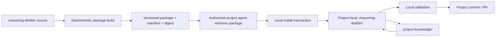
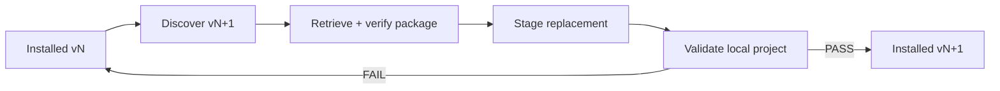

# Local Install Package Architecture — Stage 1 Proposal

Status: **Proposed**
Method: `proposal-review-synthesis/1`
Role activation: **Engineer acting as proposal author / RPG Engineer responsibility**

## Problem

A consuming project should run a local, self-contained Reasoning Distiller installation. Runtime behavior must not depend on a checkout, import, symlink, API call, or other working reference to the generic `reasoning-distiller` repository. The generic repository should remain relevant only for version provenance and explicit install/update discovery and retrieval.

The installation mechanism should be a package that an authorized agent can retrieve from the Reasoning Distiller repository and install into a project directory using the agent's existing authority in that project. The Reasoning Distiller repository therefore needs no credential capable of writing consumer repositories.

## Decision requested

Adopt a deterministic, versioned **install package** as the distribution boundary between the generic framework and consuming projects.

## Proposed architecture



The distribution direction is **pull by the consuming-project agent**, never push from the framework repository.

## Ownership boundary

| Asset | Generic repository | Install package | Consumer project |
|---|---:|---:|---:|
| Generic role contracts | source | yes | installed copy |
| RGP protocols/schemas | source | yes | installed copy |
| Generic validators | source | yes | installed copy |
| Generic admission/proof tooling | source | yes | installed copy |
| Generic backend contracts/tooling | source | yes | installed copy where selected |
| Project canonical PEMS/COVE data | no | no | project-owned |
| Project rules/policy | no | no | project-owned |
| Project authority configuration | no | no | project-owned |
| Project evidence/transactions/dispositions | no | no | project-owned |
| Source version/provenance metadata | source | generated | local metadata |

## Package contract

Define `reasoning-distiller-install-package/1` with three release artifacts:

```text
reasoning-distiller-<version>.tar.gz
reasoning-distiller-<version>.manifest.json
reasoning-distiller-<version>.sha256
```

The archive installs one managed tree:

```text
.reasoning-distiller/
├── agents/
├── protocols/
├── schemas/
├── validators/
├── admission/
├── backends/
├── VERSION
└── INSTALLATION.json
```

The exact tree may omit empty categories, but package paths must be explicit in the manifest.

### Manifest minimum fields

| Field | Purpose |
|---|---|
| contract | identifies install-package contract |
| version | release/version identity |
| source_commit | immutable framework source identity |
| package_digest | digest of archive bytes |
| files[] | installed relative path + content digest + mode |
| managed_roots[] | paths installer is permitted to replace/remove |
| compatibility | supported project/package contract versions |

`INSTALLATION.json` is generated from verified package metadata and records installed version, source identity, package digest, installation timestamp, and installer contract. Repository URLs may appear there only as provenance/update metadata.

## Installation transaction

1. Agent retrieves a chosen package and detached manifest/digest.
2. Verify package digest before extraction.
3. Verify archive paths cannot escape the target install root.
4. Read any existing `INSTALLATION.json` and prior manifest.
5. Detect drift in previously managed files. Fail closed unless an explicit force/recovery policy authorizes replacement.
6. Stage extraction outside the live managed tree.
7. Verify every staged file against the package manifest.
8. Replace only declared managed paths.
9. Write installation metadata.
10. Run local framework and project compatibility validation using only installed files.
11. Verify no runtime dependency on the source repository exists.
12. Agent commits the resulting project diff through the project's normal governance path.

The installer never writes project knowledge except installation metadata inside the managed framework root.

## Update model

An update is the same transaction with a newer package. It is not a separate mutation protocol.



Files that existed in the old package but not the new package are removed only if the old installation manifest proves they were managed framework files. Unmanaged project files are never removed.

## Runtime isolation invariant

A conforming installation must pass an offline/isolation test:

> With the generic repository unavailable and network access disabled, all installed runtime validation, Distiller activation, reconciliation-support tooling, and deterministic execution capabilities that are part of the package continue to operate from project-local files.

Allowed references to the source repository are limited to:

- provenance metadata;
- human documentation;
- explicit version/update discovery tooling that is not needed for runtime operation.

Forbidden runtime dependencies include cross-repository checkout, imports from a remote clone, symlinks outside the project installation, remote schema fetches, and executable references to generic-repository paths.

## Credential model

The framework repository publishes read-only artifacts. It receives no consumer-repository write credential.

The installing agent already operates in the target project and uses its existing project authority to retrieve, install, validate, and commit. Installation therefore does not create a new cross-repository authority channel.

## Determinism and supply-chain controls

- A release package is built from one immutable source commit.
- Package contents and ordering are deterministic where the archive format permits it.
- Every installed file is content-digested.
- Package digest verification occurs before installation.
- Path traversal, duplicate archive paths, undeclared files, and manifest/archive disagreement fail closed.
- CI rebuilds the package and checks reproducibility before release acceptance.
- Release provenance identifies source commit and build contract.

Signing may be added as a later compatibility-preserving control; digest verification is mandatory in version 1.

## Compatibility

Installation validation checks the package's declared compatibility against the consuming Project Knowledge Package and selected canonical backend contracts. Compatibility failure prevents installation completion but does not modify project knowledge.

Generic package updates must not silently migrate project canonical state. Any canonical migration remains a separately governed project operation.

## Failure and recovery

| Failure | Required behavior |
|---|---|
| Download interrupted | no live-tree change |
| Digest mismatch | reject package |
| Unsafe archive path | reject package |
| Existing managed-file drift | stop and report exact paths |
| Staged validation failure | preserve previous installation |
| Compatibility failure | preserve previous installation |
| Process dies before swap | discard/recover staging; live install unchanged |
| Process dies during swap | recover from transaction metadata/backup before further operation |
| Post-install project validation fails | restore previous managed snapshot and report failure |

Implementation should prefer an atomic directory replacement where platform/filesystem semantics permit it; otherwise use an explicit journaled transaction.

## Implementation sequence

| Gate | Work | Exit criterion |
|---|---|---|
| P1 | Freeze package contract and managed-tree boundary | schema + examples validate |
| P2 | Deterministic package builder | two builds from same source produce identical declared contents/digests |
| P3 | Local installer | clean install and update pass; unmanaged files untouched |
| P4 | Drift/recovery hardening | destructive and interrupted cases fail/recover closed |
| P5 | Runtime isolation | full installed test suite passes with source repo unavailable/network disabled |
| P6 | Voxel-engine migration | existing cross-repo runtime checkout removed; project uses local install |
| P7 | Release/update proof | agent retrieves newer package, updates locally, validates, and produces auditable diff |

## Acceptance criteria

- Consumer runtime has no working dependency on the generic repository.
- A package can be retrieved with read access and installed by an agent already authorized in the target project.
- The framework repository holds no consumer write credential.
- Package and per-file integrity are verified.
- Installation modifies only managed framework paths.
- Unexpected local drift fails closed.
- Failed installs preserve the prior working installation.
- Installed framework operates offline.
- Project knowledge remains outside the package and project-owned.
- Updates are reviewable as ordinary project diffs.

## Risks / unresolved questions

1. **Archive reproducibility:** exact `.tar.gz` byte reproducibility requires normalized timestamps, ownership, ordering, and gzip headers; content-manifest reproducibility may be the more portable normative requirement.
2. **Atomic replacement portability:** Windows and POSIX replacement behavior differs; the installer needs a tested transaction strategy rather than assuming rename semantics.
3. **Release transport:** GitHub Release assets are convenient but the contract should describe artifacts, not bind runtime semantics to GitHub.
4. **Signing:** signatures are desirable but should not block the initial digest-bound package if release provenance and repository controls are sufficient for the first production gate.
5. **Executable entrypoint:** installation should eventually expose one stable local command/agent entrypoint; its exact CLI belongs to the production invocation contract rather than this distribution proposal.

## Recommendation

Proceed with a pull-based, deterministic install package and local managed framework tree. Treat all existing cross-repository runtime checkouts and pointer files as transitional infrastructure to be removed when the package migration passes its isolation gate.
