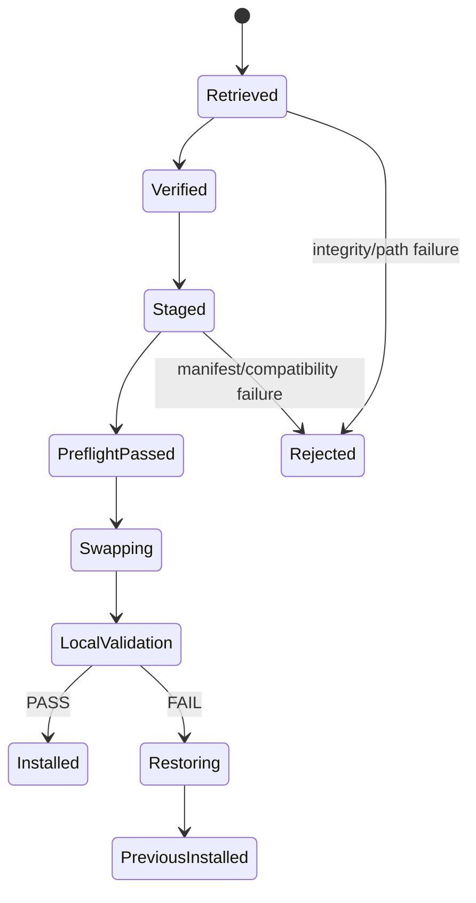

# Local Install Package Architecture — Stage 2 Engineering Review

Status: **Review complete**
Method: `proposal-review-synthesis/1`
Role activation: **Engineer, separate independent review/synthesis invocation**
Reviews: `01-engineer-proposal.md` at commit `65363340ac377b88658b4ad38aa7edd3e1c007f8`

## Recommendation

**APPROVE WITH REQUIRED AMENDMENTS.**

The pull-based local package boundary is implementable and materially cleaner than cross-repository runtime checkout. The proposal correctly separates distribution authority from project write authority. Before implementation, the final architecture should tighten transaction ownership, package reproducibility semantics, installation state, and update discovery.

## Findings

| Severity | Finding | Required amendment |
|---|---|---|
| Required | Archive-byte reproducibility is platform/tool sensitive | Make the canonical package identity a deterministic manifest/content-set digest; archive-byte digest remains transport integrity |
| Required | `INSTALLATION.json` alone cannot safely drive rollback/drift decisions | Persist the exact installed package manifest locally, immutable for that installation |
| Required | Swap/rollback semantics are underspecified | Define staged install + previous-snapshot/transaction journal semantics; never mutate project knowledge |
| Required | Package may accidentally include project policy | Add a build-time deny/test boundary proving package paths contain generic framework only |
| Required | Update discovery could become runtime coupling | Separate `install` from optional `check-update`; installed runtime must not invoke update discovery implicitly |
| Required | Existing transition pointers/checkouts need an explicit retirement gate | Voxel migration gate must search active workflows/scripts/config for generic-repo runtime references and require zero |
| Recommended | Tar format is implementation detail | Contract package payload independently of `.tar.gz`; v1 may standardize tar.gz transport |
| Recommended | Version labels alone can be ambiguous | Bind version to source commit and content-set digest; reject same version with different content |
| Recommended | Consumer compatibility needs machine form | Define compatibility fields for framework/package contract, Project Knowledge Package contract, and backend contract |

## Synthesized architecture

Use three distinct identities:

1. **Release identity** — human/version identity such as `0.1.0`.
2. **Content identity** — deterministic digest over canonical manifest entries `(path, mode, content_digest)` plus package-contract metadata.
3. **Transport identity** — SHA-256 of downloaded archive bytes.

This avoids making gzip metadata part of semantic package identity while still detecting corrupted downloads.

Install local state should be:

```text
.reasoning-distiller/
├── ...framework files...
└── .installation/
    ├── INSTALLATION.json
    └── MANIFEST.json
```

`MANIFEST.json` is the exact verified release manifest used to install the live tree. Drift detection compares managed live paths to it. `INSTALLATION.json` records installation event/provenance and points to the content identity.

### Transaction model



The installer owns only `.reasoning-distiller/`. A project may read its Project Knowledge Package during preflight/validation, but the installer may not migrate or modify it.

For crash safety, preserve either the previous managed tree or enough verified package material to restore it, plus a transaction journal outside the directory being replaced until completion. Recovery runs before any new install/update.

## Package build boundary

The builder should use an explicit allowlist of framework source roots rather than package the repository wholesale. CI must reject:

- evaluation/reference corpus unless intentionally shipped as test-only package content;
- project knowledge instances;
- extraction history;
- repository-specific workflow credentials/configuration;
- active links/imports/checkouts to consumer repositories.

Tests required at build time:

- no symlinks escaping package root;
- no absolute paths;
- no undeclared files;
- no duplicate normalized paths;
- no source-repository dependency in executable runtime configuration;
- canonical manifest generation stable across two clean builds.

## Install versus update discovery

Keep these independent:

```text
rd-install <local-package-or-retrieved-artifact> <project-root>
rd-check-update <installed-metadata>     # optional network operation
```

An agent may itself retrieve the package and invoke the local installer; the installer does not need network support at all. This is preferable because it makes the installation mechanism transport-neutral and trivially testable offline.

The repository may publish metadata that helps agents find current releases, but update discovery is not part of runtime correctness.

## Voxel-engine migration

The migration should not merely change a checkout path. It must demonstrate:

1. package built from accepted standalone framework source;
2. agent installs package into voxel-engine repository;
3. active workflows/scripts use only `.reasoning-distiller/`;
4. project-owned `project-knowledge/` remains external to managed tree;
5. network/source repository is made unavailable during integration tests;
6. search/audit reports zero executable cross-repository references;
7. transitional pointer files are removed unless retained solely as historical documentation outside runtime paths.

## Failure pressure cases

Add explicit tests for:

- archive path case-fold collisions on case-insensitive filesystems;
- package containing a path that conflicts with an existing directory/file shape;
- interrupted update after old tree moved but before new tree activated;
- interrupted restoration;
- same version but different content identity;
- downgrade policy;
- local deletion/addition/modification inside managed tree;
- read-only target files;
- malformed installed manifest;
- package compatible with framework contract but incompatible with project/backend contract.

## Proposed gate refinement

| Gate | Proof |
|---|---|
| P1 Contract | schemas, canonical content-identity algorithm, ownership boundary |
| P2 Builder | deterministic manifest/content identity + transport digest; allowlist isolation |
| P3 Installer | clean install, update, downgrade policy, drift detection |
| P4 Recovery | crash/journal pressure suite |
| P5 Isolation | offline runtime and zero executable remote references |
| P6 Consumer | voxel-engine migrated with project knowledge untouched |
| P7 Update | second package update produces exact auditable project diff |
| P8 Release | accepted package/version baseline and operator/agent instructions |

## Synthesis

The proposal's central decision should stand: **distribution is a read-only package; installation authority belongs to the agent already operating in the consuming project.**

The final plan should make the installer itself network-independent and transport-neutral. Retrieval is an agent responsibility. The package's canonical identity should be its manifest/content set rather than compressed archive bytes. This yields a stronger offline boundary, easier reproducibility, and fewer hidden GitHub-specific assumptions.
