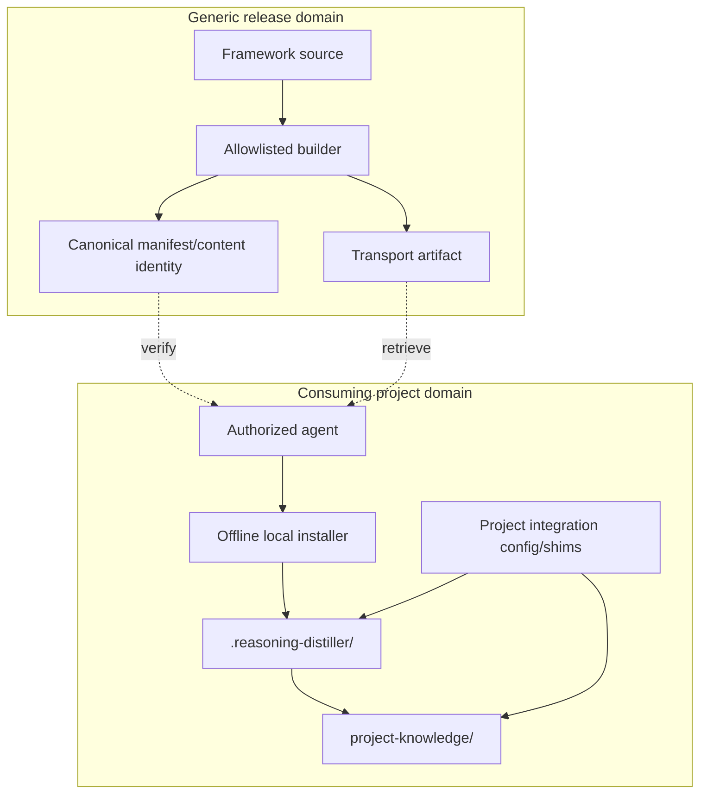

# Local Install Package Architecture — Architect Review

Status: **Review complete**
Method: `proposal-review-synthesis/1` with explicit Architect stage
Role activation: **Architect**
Inputs: Stage-1 proposal and Stage-2 Engineer review/synthesis

## Recommendation

**APPROVE WITH CHANGES.**

The package boundary is architecturally preferable to runtime cross-repository coupling. The Engineer amendments should be accepted. Two additional architectural constraints are required: distinguish the framework installation root from project integration shims, and do not package active project authority configuration with generic role definitions.

## Architecture assessment



Dependency direction is local after retrieval. The installed framework may consume project-supplied contracts/configuration through defined interfaces, but generic package content must not encode the consuming project's authority, canonical data, or policy.

## Required architectural amendments

### A1 — Integration shims are project-owned

Do not place project-specific workflow wrappers, role assignments, authority bindings, canonical paths, or adapter configuration under the package-managed `.reasoning-distiller/` tree merely because they invoke the framework.

Keep them in a project-owned integration area, e.g. `project-knowledge/integration/` or another project-selected location. This prevents an update from overwriting project policy and keeps the installer ownership boundary mechanically enforceable.

### A2 — Generic roles versus activated roles

The package may include generic `Architect`, `Distiller`, `Engineer`, and `Steward` role contracts. It must not include a statement that any generic role instance is authorized for a consuming project. Project role activation/authority remains project knowledge.

### A3 — Backend packaging

PEMS/COVE schemas and generic validators may ship as a first-party backend module. Active PEMS/COVE datasets and project-specific backend policy may not. Backend modules should be selectable package components only if componentization becomes necessary; do not build a plugin system for v1.

### A4 — No source-repository runtime locator

No runtime path resolver should fall back to the generic repository when a local file is absent. Missing installed content is an installation failure, not a reason to fetch or locate source content remotely.

## Versioning topology

Use one framework release version plus explicit contract versions inside the package. Do not force all protocol/schema versions to equal the framework release version.

```text
framework release: 0.x.y
package contract: reasoning-distiller-install-package/1
RGP: rgp/1
Project Knowledge Package: project-knowledge-package/1
backend contracts: independently versioned
```

The installed metadata binds all relevant versions and the content identity.

A release update may change generic implementation without changing RGP semantics. A semantic protocol change requires its own established proposal/evaluation path and must not be smuggled through packaging.

## Release topology

The architecture requires an immutable retrievable artifact, not a particular hosting feature. GitHub Releases may be the first publisher. An agent should be able to retrieve by release/version or exact artifact URL, verify locally, and then operate without the publisher.

Do not make `main` itself the install source. `main` produces candidate releases; an accepted immutable package is the distribution unit.

## Security/trust boundary

Digest verification proves integrity relative to expected metadata, not publisher authenticity. For v1, repository/release access plus immutable source identity may be an acceptable trust anchor, but the contract should reserve an optional signature/attestation field without requiring a signing system now.

Do not allow an installer flag such as `--force` to casually bypass managed-file drift. Recovery/override should require an explicit policy/action and should preserve the displaced local tree as evidence.

## Acceptance architecture

A consumer is correctly installed when all are true:

| Property | Test |
|---|---|
| Locality | source repo/network unavailable; runtime passes |
| Ownership | package-managed tree contains no project authority/canonical state |
| Completeness | missing packaged runtime file fails locally rather than remote fallback |
| Integrity | content identity and all file hashes verify |
| Isolation | zero executable cross-repository references |
| Upgrade safety | unmanaged project paths untouched; drift detected |
| Governance | generic roles have no project authority absent project activation |
| Auditability | version/source/content identity and exact installed manifest persisted |

## Architect disposition

Accept the Engineer synthesis and amendments, plus A1–A4 above. The implementation should replace the current cross-repository consumer model only after the offline/locality and project-ownership gates pass. Until then, the current integration is transitional and must not be mistaken for the production distribution architecture.
