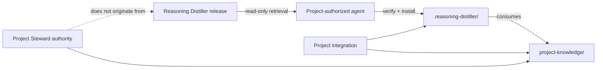
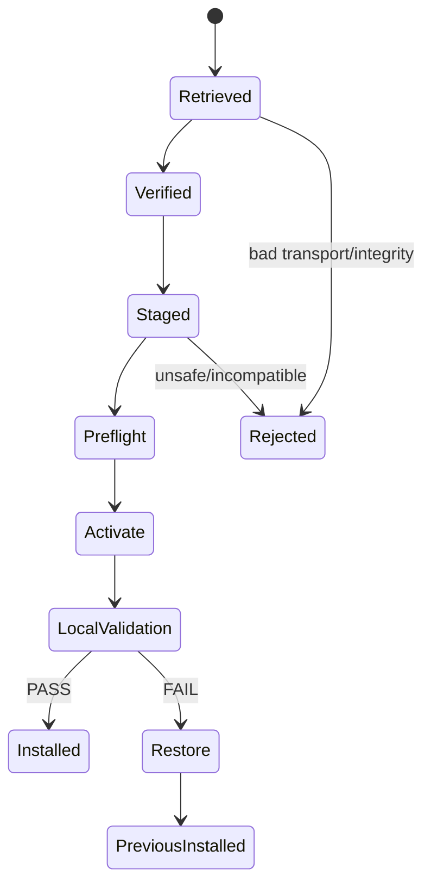

# Reasoning Distiller Local Package Distribution — Final Plan

Status: **APPROVED FOR IMPLEMENTATION**
Method: `proposal-review-synthesis/1`
Final authority activation: **Project Knowledge Steward**

Supersedes for production distribution: the transitional cross-repository checkout/pointer consumer model.

## 1. Decision

Distribute Reasoning Distiller as an **immutable, versioned install package**. An agent already authorized in a consuming project retrieves and verifies the package, installs it into that project, validates the local result, and commits/reviews the project change through that project's normal governance path.

The Reasoning Distiller repository receives **no credential capable of writing consumer repositories**.

After retrieval, the installed framework is self-contained. Runtime has no working reference to the generic repository.

## 2. Review disposition

| Review | Recommendation | Steward disposition |
|---|---|---|
| Stage 1 Engineer proposal | Adopt pull-based deterministic package | **Accepted** |
| Stage 2 Engineer | Approve with transaction, identity, isolation amendments | **Accepted** |
| Architect | Approve with project-integration/role/backend boundary amendments | **Accepted** |

No material disagreement remains. The reviews converged on a local, transport-neutral installer and immutable release artifact rather than cross-repository runtime coupling.

## 3. Authority and ownership model



| Concern | Owner |
|---|---|
| Generic framework source/release | Reasoning Distiller project |
| Package integrity/content identity | Reasoning Distiller release contract |
| Retrieval | consuming-project agent |
| Installation into project | consuming-project agent under existing project authority |
| Installed generic tree | package-managed local project content |
| Integration wrappers/config | consuming project |
| Role activation/authority | consuming project knowledge package |
| Canonical PEMS/COVE data | consuming project |
| Semantic reconciliation/admission | authorized project Steward |

**Invariant:** packaging or installing a generic Steward role definition does not grant Steward authority in a consuming project.

## 4. Distribution and local layout

### Release artifacts

V1 publishes:

```text
reasoning-distiller-<version>.tar.gz
reasoning-distiller-<version>.manifest.json
reasoning-distiller-<version>.sha256
```

The transport may evolve without changing the semantic package contract.

### Installed managed tree

```text
.reasoning-distiller/
├── agents/
├── protocols/
├── schemas/
├── validators/
├── admission/
├── backends/
├── VERSION
└── .installation/
    ├── INSTALLATION.json
    └── MANIFEST.json
```

Only generic framework material belongs here.

### Project-owned tree

```text
project-knowledge/
├── canonical/
├── evidence/
├── rules/
├── roles/          # activation/overrides, not generic definitions
├── authority/
├── policy/
├── adapters/
└── integration/
```

Names inside the project-owned tree may vary by project. Ownership may not.

## 5. Package identity

Use three identities:

| Identity | Meaning |
|---|---|
| Release version | human/version selection, e.g. `0.1.0` |
| Content identity | canonical digest of package-contract metadata plus sorted `(path, mode, content_digest)` entries |
| Transport digest | SHA-256 of retrieved archive bytes |

The **content identity is canonical** for installed package contents. The transport digest detects download corruption. A release version must not resolve to multiple content identities.

`MANIFEST.json` persists the exact verified manifest locally. `INSTALLATION.json` records release version, source commit, content identity, transport digest, installation event, relevant contract versions, and optional source/update metadata.

## 6. Package build boundary

The builder uses an explicit allowlist. It must not package the repository wholesale.

Include generic runtime/framework assets required by the release. Exclude:

- active project knowledge instances;
- voxel-engine reference/evaluation corpus unless intentionally shipped in a separate test artifact;
- extraction history;
- project-specific role authority/activation;
- project workflow credentials/configuration;
- consumer-specific adapters/integration wrappers.

Build validation rejects unsafe/duplicate/absolute paths, escaping symlinks, undeclared files, and executable remote-runtime references.

PEMS/COVE generic schemas/validators may ship as first-party backend tooling. Active PEMS/COVE data never ships in the generic package.

## 7. Installer contract

Contract: `reasoning-distiller-install-package/1`.

The installer is **network-independent and transport-neutral**. Retrieval is performed by the agent or surrounding environment.



Installation sequence:

1. Accept local package + manifest + expected transport digest.
2. Verify transport digest.
3. Validate package contract and archive paths.
4. Verify canonical content identity and every file digest.
5. Recover any incomplete prior installation transaction before proceeding.
6. Load previous local manifest and detect managed-file drift.
7. Check Project Knowledge Package/backend compatibility read-only.
8. Stage the complete new managed tree.
9. Preserve the prior managed snapshot and transaction journal.
10. Activate the staged tree.
11. Run local framework + project integration validation with no source-repository fallback.
12. On PASS, finalize installation metadata and remove recovery material.
13. On FAIL, restore the previous managed tree and preserve failure evidence.

The installer may read project knowledge for compatibility/validation. It may not migrate or modify project knowledge.

## 8. Update behavior

An update is an install of another verified package over the managed tree.

- New package files are installed.
- Old files absent from the new package are removed only when the previous manifest proves they were package-managed.
- Unmanaged files are untouched.
- Local modification/deletion/addition inside managed paths is reported as drift and fails closed by default.
- Downgrade policy is explicit; never infer it from version ordering alone.

Optional update discovery is separate from runtime and installation:

```text
agent / rd-check-update  -> network/repository metadata
rd-install               -> local files only
installed runtime        -> local files only
```

No runtime resolver may fetch or locate missing framework files in the source repository.

## 9. Required isolation property

A production installation must satisfy:

> With the generic `reasoning-distiller` repository unavailable and network access disabled, all packaged runtime behavior continues to operate from project-local files.

Source repository references are permitted only in provenance, documentation, and explicit update-discovery metadata/tooling.

Executable/runtime references, remote schema fetches, remote imports, cross-repository checkouts, and fallback path resolution are forbidden.

## 10. Integrity and trust

Mandatory V1 controls:

- immutable source commit recorded;
- canonical content identity;
- archive transport SHA-256;
- per-file digests/modes;
- allowlisted package roots;
- reproducible canonical manifest/content identity across clean builds;
- safe archive extraction;
- local verified manifest persistence.

The contract reserves optional signature/attestation metadata. Signature infrastructure is not a V1 blocker; digest verification does not by itself claim publisher authenticity.

## 11. Failure/recovery pressure suite

Must cover at least:

| Case | Expected result |
|---|---|
| interrupted retrieval | live install unchanged |
| bad transport digest | reject |
| manifest/content mismatch | reject |
| traversal/absolute/duplicate/case-fold collision | reject |
| undeclared archive file | reject |
| project/backend incompatibility | reject before activation |
| managed file modified/deleted/added locally | drift failure |
| file↔directory shape conflict | fail safely |
| interruption during activation | journaled recovery to known installation |
| interruption during restore | recover deterministically before next operation |
| post-activation validation failure | previous install restored |
| same version/different content identity | reject |
| missing runtime file | local failure; never remote fallback |
| source repository/network unavailable | runtime PASS |

## 12. Implementation plan

| Gate | Implementation | Exit proof |
|---|---|---|
| **P1 Contract** | package/manifest/installation schemas; content-identity algorithm; managed/project boundary | schemas + examples + contract tests PASS |
| **P2 Builder** | allowlisted deterministic builder | two clean builds yield same canonical manifest/content identity; exclusion tests PASS |
| **P3 Installer** | local staged installer, drift detection, compatibility checks | clean install/update/downgrade-policy tests PASS |
| **P4 Recovery** | journal/snapshot recovery | interruption and destructive pressure suite PASS |
| **P5 Isolation** | remote-reference audit + offline suite | network/source repo absent; runtime PASS; zero executable remote refs |
| **P6 Voxel migration** | install package locally into voxel-engine; move integration to local paths | project knowledge unchanged; cross-repo runtime checkout removed |
| **P7 Update proof** | retrieve/install a second package version | exact auditable update diff + validation PASS |
| **P8 Release** | publish accepted immutable baseline + agent/operator instructions | release identity/content identity recorded; install-from-package demonstrated |

P1–P5 belong primarily to the generic framework. P6–P7 prove the consumer/update model. Do not declare production distribution complete before P7.

## 13. Voxel-engine migration acceptance

The first consumer migration must prove:

1. package built from an accepted standalone source commit;
2. package retrieved read-only by an agent;
3. package installed into `.reasoning-distiller/`;
4. active scripts/workflows use only local installed framework paths;
5. `project-knowledge/` canonical data, evidence, rules, authority, policy, and role activation remain project-owned;
6. source repository/network are unavailable during integration tests;
7. audit finds zero executable cross-repository references;
8. transitional pointer/checkouts are removed from active paths;
9. a later package update succeeds through the same mechanism.

## 14. Approved invariants

- Distribution is pull-based; the framework repository never needs consumer write credentials.
- Installed runtime is local and self-contained.
- Generic source repository references are non-runtime metadata/update concerns only.
- Installer owns only its declared managed tree.
- Project knowledge and integration policy remain project-owned.
- Generic roles do not confer project authority.
- Distiller remains candidate producer only.
- Project Steward remains semantic reconciliation/admission authority when granted by project configuration.
- Executor/installer mechanics do not acquire semantic authority.
- Package updates do not silently migrate canonical knowledge.
- Integrity, compatibility, drift, and recovery failures fail closed.

## 15. Definition of done

Production package distribution is complete when an authorized agent can retrieve an immutable Reasoning Distiller release package using read access, verify and install it into a clean or previously installed consumer project, operate the installed framework offline with no generic-repository runtime dependency, update it through a second package with a reviewable diff, recover safely from tested interruption/failure cases, and demonstrate that no project-owned knowledge or authority was overwritten or transferred.

## 16. Next authorized action

Begin **P1 — Package Contract** in `loteque/reasoning-distiller`.

Do not redesign RGP semantics or project reconciliation authority as part of P1. Define the package manifest, installation metadata, canonical content-identity algorithm, managed-tree boundary, compatibility fields, examples, and contract tests required by this plan.
